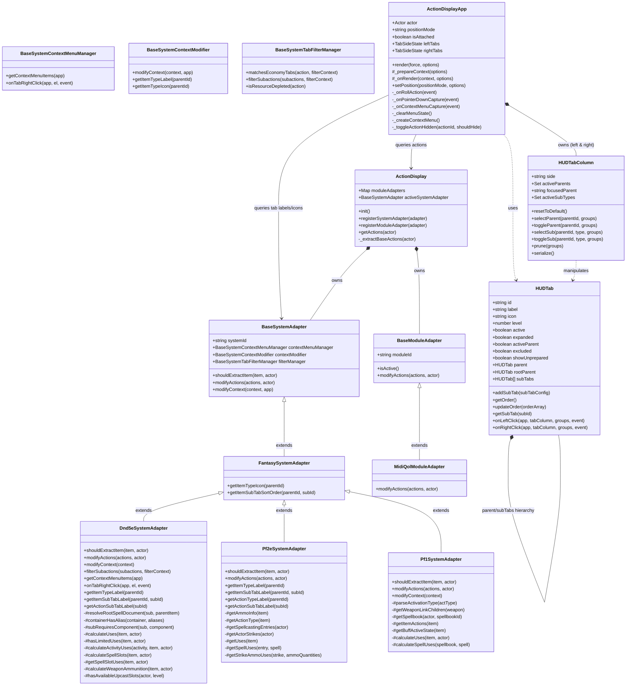
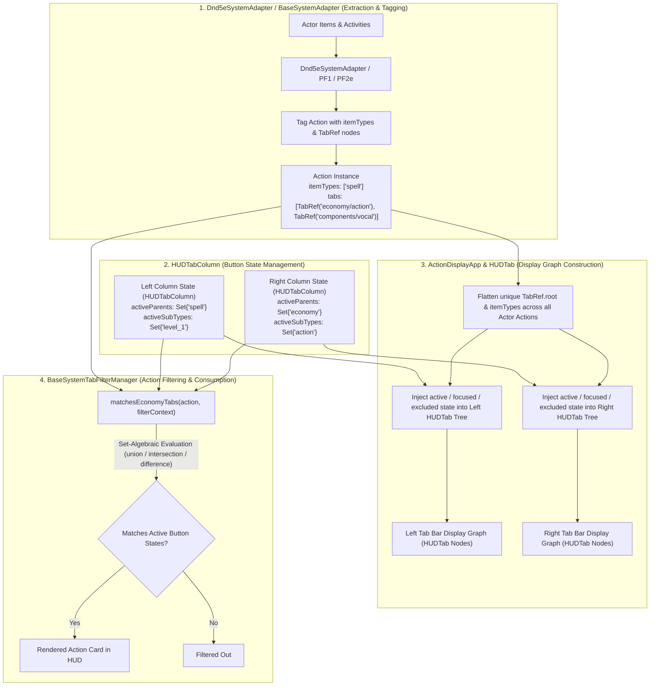
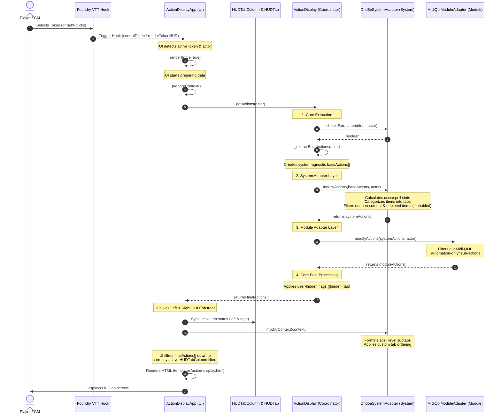
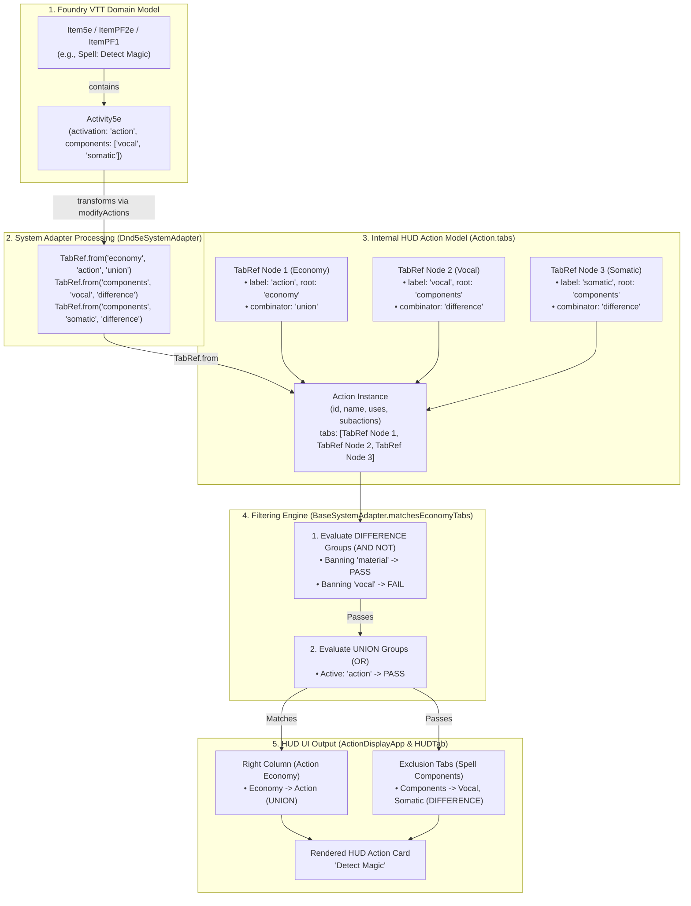

# Architecture & Lifecycle Guide

This document explains the architecture of **Bakana's Action Display** and provides a visual guide to how the different class layers integrate, culminating in the rendering of the Token HUD. For a complete function-by-function call tree and detailed API reference, see the **[Function Call Tree & Developer API Reference](function_tree.md)**.

---

## 1. Architectural Layers

The module is built using a clean **pipes-and-filters / adapter** architecture, divided into four distinct layers:

```
┌────────────────────────────────────────────────────────┐
│                        UI Layer                        │
│                (ActionDisplayApp)                      │
└──────────────────────────┬─────────────────────────────┘
                           │ queries actions & layout
                           ▼
┌────────────────────────────────────────────────────────┐
│                    Coordinator Layer                   │
│                    (ActionDisplay)                     │
└──────────────────────────┬─────────────────────────────┘
                           │ runs pipeline
                           ▼
┌────────────────────────────────────────────────────────┐
│                  System Adapter Layer                  │
│  (BaseSystemAdapter ◄─ FantasySystemAdapter ◄─ Dnd5e) │
└──────────────────────────┬─────────────────────────────┘
                           │ modifies & categorizes
                           ▼
┌────────────────────────────────────────────────────────┐
│                  Module Adapter Layer                  │
│      (BaseModuleAdapter ◄─── MidiQolModuleAdapter)     │
└───────────────────────────┬────────────────────────────┘
                            │ filters & augments
                            ▼
                    [ Final HUD Render ]
```

### 1. Core / Coordinator (`ActionDisplay`)
*   **Role**: The central pipeline controller (a singleton instance exported from `src/action-display.js`).
*   **Responsibilities**:
    *   Detects the active game system and registers the appropriate system and module adapters.
    *   Performs the **Core Extraction**: iterates over all items on an actor and extracts a basic, system-agnostic list of actions (name, image, item ID, and roll functions). Before extracting full item data, queries `shouldExtractItem` on the active system adapter to bypass unneeded allocations.
    *   Runs the pipeline: `Core Extraction ──► System Adapter ──► Module Adapters ──► Core Post-Processing (User-Hidden Filters)`.

### 2. System Adapter Layer (`BaseSystemAdapter`, `FantasySystemAdapter`, & System Managers)
*   **Role**: Handles system-specific rules, resource calculations, UI context formatting, tab filtering, and right-click context menu options.
*   **Responsibilities**:
    *   **`BaseSystemAdapter`**: The core, genre-agnostic base class. It composes three specialized manager instances:
        *   **`BaseSystemContextMenuManager`** (`src/adapters/system/context-menu/`): Manages action card context menu items and tab right-click shortcuts.
        *   **`BaseSystemContextModifier`** (`src/adapters/system/context-modifier/`): Manages UI context modifications, tab label/icon localization, and sort orders.
        *   **`BaseSystemTabFilterManager`** (`src/adapters/system/filter/`): Evaluates set-algebraic tab filter trees (`union`, `intersection`, `difference`) and checks resource depletion.
    *   **`FantasySystemAdapter`**: An intermediate class extending the base adapter. It houses shared defaults for fantasy RPG systems, such as default icon mappings for weapons, spells, feats, and consumables, as well as the numerical spell-level sorting algorithm.
    *   **Concrete Adapters** (e.g., `Dnd5eSystemAdapter`, `Pf1SystemAdapter`, `Pf2eSystemAdapter`): Inherit from `FantasySystemAdapter` and instantiate system-specific managers (`Dnd5eSystemContextMenuManager`, `Dnd5eSystemContextModifier`, `Dnd5eSystemTabFilterManager`) to implement system rules without cluttering the adapter.
        ```text
        src/adapters/system/
        ├── base-system-adapter.js
        ├── dnd5e-system-adapter.js
        ├── pf1-system-adapter.js
        ├── pf2e-system-adapter.js
        ├── context-menu/
        │   ├── base-system-context-menu-manager.js
        │   └── dnd5e-system-context-menu-manager.js
        ├── context-modifier/
        │   ├── base-system-context-modifier.js
        │   └── dnd5e-system-context-modifier.js
        ├── filter/
        │   ├── base-system-tab-filter-manager.js
        │   └── dnd5e-system-tab-filter-manager.js
        └── genre/
            └── fantasy-system-adapter.js
        ```
    *   Maps system-native entities into the generic HUD model (`item` = Item Card, `activities` = Sub-options/Activities):
        *   **D&D 5e**: `item` ──► `Item5e`, `activities` ──► `Activity5e` instances.
        *   **Pathfinder 2e**: `item` ──► `ItemPF2e` / `Strike`, `activities` ──► Strike options / weapon modes.
        *   **Pathfinder 1e**: `item` ──► `ItemPF1`, `activities` ──► Linked attack items / multi-action formulas.
    *   Filters out depleted actions if the "Filter Depleted Actions" setting is enabled, using system-specific rules.

### 3. Module Adapter Layer (`BaseModuleAdapter`)
*   **Role**: Handles third-party module integrations (like `midi-qol`) without cluttering the core or system layers.
*   **Responsibilities**:
    *   Inspects active module flags on actions and modifies them (e.g., filtering out Midi-QOL "automation-only" activities from the player-facing HUD).

### 4. UI Layer (`ActionDisplayApp`, `HUDTabColumn`, `HUDTab`, `TabRef`, & `ContextMenuManager`)
*   **Role**: The rendering engine and state management system, built on Foundry VTT's modern `ApplicationV2` (`HandlebarsApplication`) framework.
*   **Responsibilities**:
    *   **`ActionDisplayApp`**: Listens to Foundry hooks (like token selection) to position and render the HUD. Manages positioning modes (`attached` dynamic token tracking and `detached` floating screen position), tab state persistence across close/open and actor switches (`_saveTabState`), scroll position preservation (`scrollable` selector), and context rendering.
    *   **`ContextMenuManager`** (`src/ui/app/context-menu-manager.js`): Manages UI right-click context menu creation for action cards, combining core actions (`Hide Action`, `Unhide Action`) with system-provided items.
    *   **`HUDTabColumn`**: Encapsulates left and right column tab states (active parents, focused parent, active sub-types) and enforces click interaction rules (exclusive left-click parent selection, multi-stage right-click toggles, sub-tab isolation).
    *   **`HUDTab`**: A unified, recursive tab UI model representing top-level parent tabs, sub-tabs, and deeply nested sub-tabs with depth levels (`level` 0, 1, 2+), parent/rootParent pointers, and click event handlers (`onLeftClick`, `onRightClick`).
    *   **`TabRef`**: A structured tab data reference class (`src/ui/tab-ref.js`) attached to item activities (`item.tabs`, `activity.tabs`). Pre-computes `.root` parent IDs and `.path` hierarchy strings (e.g. `'economy/action'`) at construction.
    *   In `_prepareContext()`, it requests the processed actions from the Coordinator, queries the active system adapter for tab layouts, delegates tab context modification, filters actions to match active tabs, and renders `templates/action-display.html`.
    *   In `_onRollAction()`, it checks if an item has multiple `activities` and dynamically renders a left-click dropdown menu if needed.

---

## 2. Class Relationships

The following diagram shows how the classes are structured and how they reference one another:



## 2.2 Action, TabRef, & Button State Data Flow

The following diagram illustrates how raw item data is tagged with `TabRef` references, how `HUDTabColumn` maintains button/tab active states, and how `ActionDisplayApp` flattens these into a customized display graph consumed during filtering and rendering:



---

## 3. The HUD Render Pipeline

This sequence diagram traces the exact lifecycle of how the HUD is created and rendered when a user selects a token in Foundry VTT:



---

## 4. TabRef Architecture & Set-Algebraic Filter Tree Evaluation

`TabRef` (`src/ui/tab-ref.js`) is the structured data bridge between game-system items (like Foundry `Item5e` documents or `Activity5e` objects) and the HUD's UI filtering engine.

### Data Flow Graph & Set Combinators

The HUD evaluates active filters using a generalized **Set-Algebraic Filter Tree** (Boolean Expression Tree). Each parent tab declares its set combinator operator (`union`, `intersection`, `difference`):

*   **`union` (`OR`)**: Default for standard category tabs (Action Economy, Weapons, Spells). An action matches if it belongs to *at least one* active sub-tab.
*   **`difference` (`AND NOT`)**: Used for exclusion/modifier tabs (Spell Components). An action matches if it does *not* possess any active banned sub-tabs.
*   **`intersection` (`AND`)**: Used for strict multi-requirement tabs. An action matches only if it satisfies *all* active sub-tabs.



### Key Responsibilities of `TabRef`

1. **Pre-computed Hierarchies ($O(1)$ Performance)**:
   - When instantiated, `TabRef` computes its `.root` (e.g. `'economy'`) and `.path` string (e.g. `'economy/action'`).
   - UI filtering loops query `tab.root` and `tab.path` directly, eliminating runtime string splitting and regex matching during render passes.

2. **System Adapter Set Authority (`getTabCombinator`)**:
   - Parent tab groups defined on the active system adapter (`adapter.getTabCombinator(parentId)`) dictate set-algebraic rules (`union`, `intersection`, `difference`) for all sub-tabs under that parent group.

3. **Multi-Category Mapping**:
   - A single `Action` can belong to multiple tab paths simultaneously by storing an array of `TabRef` nodes (e.g., Action Economy tab + Spell Component exclusion tabs).

4. **Guaranteed Flat `TabRef[]` Arrays (`Action.tabs`)**:
   - All system adapters and core extractors construct `tabs` directly as a flat `TabRef[]` array using `TabRef.from(rootLabel, subLabel)`.

5. **Factory Instantiation (`TabRef.from`)**:
   - System adapters use `TabRef.from(rootLabel, subLabel)` to instantiate parent/child tab nodes without writing verbose constructor boilerplate:
     ```javascript
     const tabRef = TabRef.from('components', 'vocal');
     // Instantiates TabRef(label: 'vocal', parent: TabRef(label: 'components'))
     ```

---

## 6. Testing & Development

The repository includes a zero-dependency native Node.js unit test suite (`node --test`) covering adapter initialization, filtering rules, and item transformation pipelines.

### Running Tests Locally
Ensure you have Node.js 18+ installed and run:
```bash
npm test
```

### Test Suite Architecture
- **Global Foundry VTT Mocks (`tests/setup.js`)**: Shims global Foundry objects (`game`, `foundry`, `Item`, `Actor`, `fromUuidSync`) so system adapters can execute offline without requiring a live Foundry server or browser environment.
- **System Adapter Coverage (`tests/**`)**: Comprehensive unit tests covering `BaseSystemAdapter`, `Dnd5eSystemAdapter`, `Pf1SystemAdapter`, and `Pf2eSystemAdapter`.

