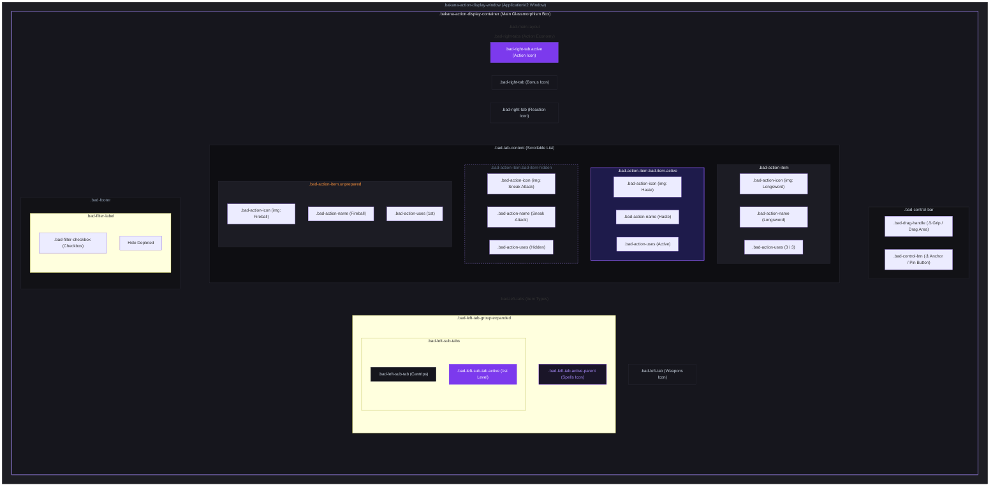

# CSS Layout & Styling Guide

This document provides a comprehensive guide to the DOM structure, CSS classes, and styling variables used in **Bakana's Action Display**. It serves as a reference for developers wishing to customize the HUD's appearance or write custom themes.

---

## Visual Layout Wireframe

The following diagram represents a visual mockup of the HUD window. It shows how the DOM elements are nested and labels each component with its corresponding CSS class and state modifiers.



---

## Design Tokens & CSS Variables

The HUD styling is driven by three primary CSS custom properties registered on the document root (`:root`). These variables allow for real-time, reactive adjustments via the module's settings menu:

| CSS Variable | Description | Default Value | Setting Controller |
| :--- | :--- | :--- | :--- |
| `--bad-hud-opacity` | Controls the transparency of the entire HUD window. | `0.88` | **HUD Opacity** (Slider: `0.1` to `1.0`) |
| `--bad-hud-scale` | Controls the overall physical size of the HUD window (width, max-height, padding, and gaps) proportionally. | `1.0` | **HUD Scale** (Slider: `0.5` to `1.5`) |
| `--bad-hud-font-size` | Controls the base font size of the text and icons *inside* the HUD. The window size remains independent. | `14px` | **Font Size (px)** (Slider: `10` to `24`) |

### How Scale and Font Size Interact
To allow independent control over the window size and text size, the stylesheet uses the following mathematical formulas:

*   **Window Dimensions**: Width, max-height, padding, and gaps are calculated in pixels multiplied *only* by the scale factor:
    ```css
    width: calc(320px * var(--bad-hud-scale, 1.0));
    max-height: calc(500px * var(--bad-hud-scale, 1.0));
    padding: calc(12px * var(--bad-hud-scale, 1.0));
    ```
*   **Content Font Size**: The base font-size of the window inherits the product of both variables. This ensures that when the HUD window scales, the text scales with it, but the text can also be adjusted independently:
    ```css
    font-size: calc(var(--bad-hud-font-size, 14px) * var(--bad-hud-scale, 1.0));
    ```
*   **Fluid Internal Elements**: All internal elements (icons, row padding, row gaps, border-radii) are defined in **`em` units** (relative to the base font-size). If you increase the font size, the icons and rows automatically expand and condense fluidly.

---

## DOM Class Reference

### 1. Window & Outer Container
*   **`.bakana-action-display-window`**
    *   *Role*: The outer window wrapper generated by Foundry's `ApplicationV2`.
    *   *Styling*: Set to `position: fixed` with a customizable opacity. It has no hardcoded `z-index`, allowing Foundry to manage its depth naturally.
*   **`.bakana-action-display-container`**
    *   *Role*: The main visual container of the HUD.
    *   *Styling*: Implements a dark glassmorphism aesthetic (`backdrop-filter: blur(12px)`) with a soft violet border and rounded corners. Constrained by the scaled width and max-height.

### 2. Control Bar
*   **`.bad-control-bar`**
    *   *Role*: The top header bar containing the drag handle and window controls.
    *   *Styling*: Flexbox layout with a dark translucent background.
*   **`.bad-drag-handle`**
    *   *Role*: The middle grab area used to drag and detach the HUD.
    *   *Styling*: Displays a cursor change (`cursor: move`) and transitions color on hover.
*   **`.bad-control-btn`**
    *   *Role*: Small buttons on the control bar (e.g., the anchor pin icon).
    *   *Styling*: Clean icon buttons with no backgrounds, glowing violet on hover.

### 3. Action List (Main Content)
*   **`.bad-main-layout`**
    *   *Role*: The flexbox row housing the left tabs, the central list, and the right tabs.
*   **`.bad-tab-content`**
    *   *Role*: The scrollable container holding the list of action cards. Registered as a `scrollable` selector in ApplicationV2 options (`scrollable: ['.bad-tab-content']`) to preserve scroll position across redraws.
    *   *Styling*: A vertical flexbox with a custom thin, violet scrollbar. Height is fluidly managed by the parent flex container (no hardcoded height).
*   **`.bad-action-item`**
    *   *Role*: An individual action card (row).
    *   *Styling*: Flexbox row containing the icon, name, and resource badge. Features a smooth hover animation that slides the card slightly to the right (`transform: translateX(3px)`) and glows violet.

### 4. Action Card Components
*   **`.bad-action-icon`**
    *   *Role*: The image representing the action.
    *   *Styling*: Set to a compact `1.2em` square with rounded corners and a subtle border. Aligns perfectly with the text height.
*   **`.bad-action-name`**
    *   *Role*: The text label showing the action's name.
    *   *Styling*: Scaled to `0.85em` with `text-overflow: ellipsis` to cleanly truncate long names without wrapping.
*   **`.bad-action-uses`**
    *   *Role*: The resource badge showing remaining charges, spell slots, or ammunition.
    *   *Styling*: A compact badge (`0.75em` font) with a translucent background.

---

## State Modifiers

Additional classes are appended dynamically to elements to represent their active states:

| Class Name | Applied To | Description | Visual Effect |
| :--- | :--- | :--- | :--- |
| **`.bad-item-active`** | `.bad-action-item` | Appended to active toggles, active buffs, or sustained effects. | Glows with a bright violet border and translucent violet background. |
| **`.bad-item-hidden`** | `.bad-action-item` | Appended to actions that the user has manually hidden via the right-click context menu. | Becomes semi-transparent (`0.45` opacity) with a dashed border. Child hover effects are suppressed. |
| **`.unprepared`** | `.bad-action-item` | Appended to spells that are not prepared (in systems like D&D 5e). | The text, border, and badges turn a soft orange. |
| **`.depleted`** | `.bad-action-uses` | Appended to resource badges when they reach `0` uses. | The badge background and text turn a soft red. |
| **`.upcast`** | `.bad-action-uses` | Appended to spell slots that are being upcast. | The badge background and text turn a soft orange. |
| **`.active`** | `.bad-left-tab` / `.bad-right-tab` | Appended to the currently selected tab. | Turns into a vibrant violet gradient with a strong shadow glow. |
| **`.active-parent`** | `.bad-left-tab` | Appended to a parent tab (like "Spells") when one of its sub-tabs (like "1st Level") is active. | Receives a subtle violet highlight indicating the active sub-category. |
| **`.unprepared-active`** | `.bad-left-sub-tab` | Appended to the "All Spells" tab when unprepared spells are toggled on. | Turns orange (if active) or receives a soft orange border (if inactive) to warn the user. |
