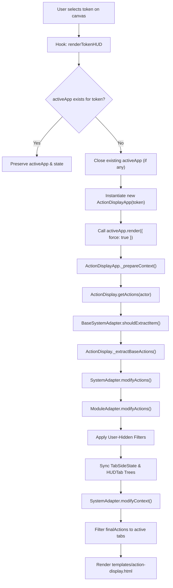
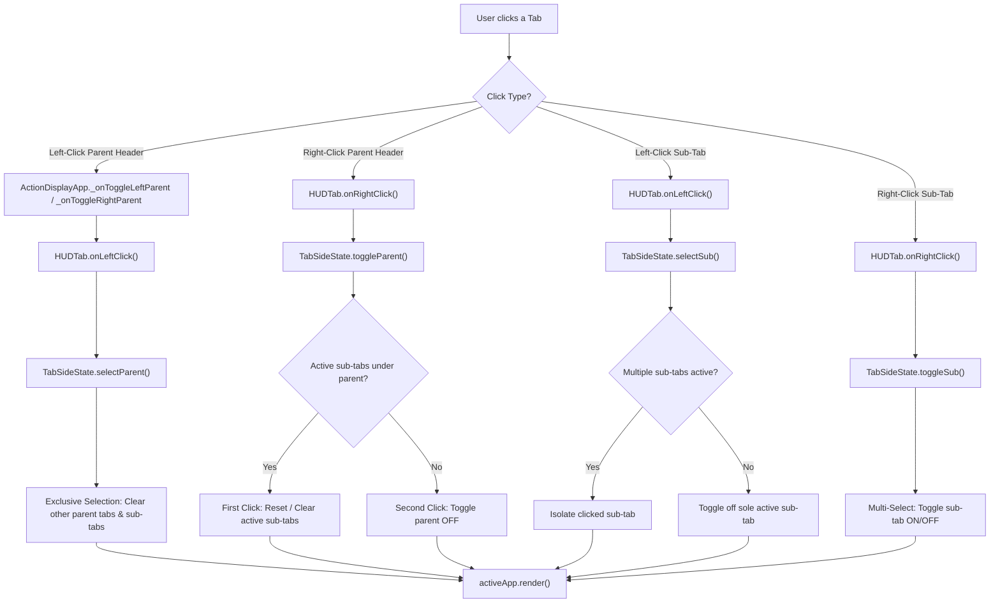
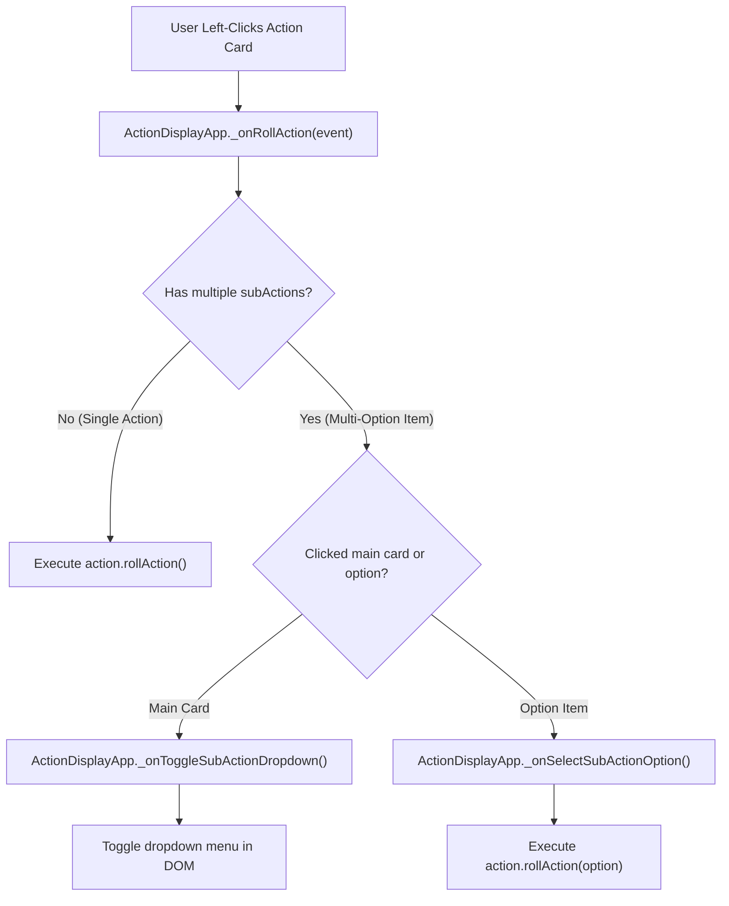
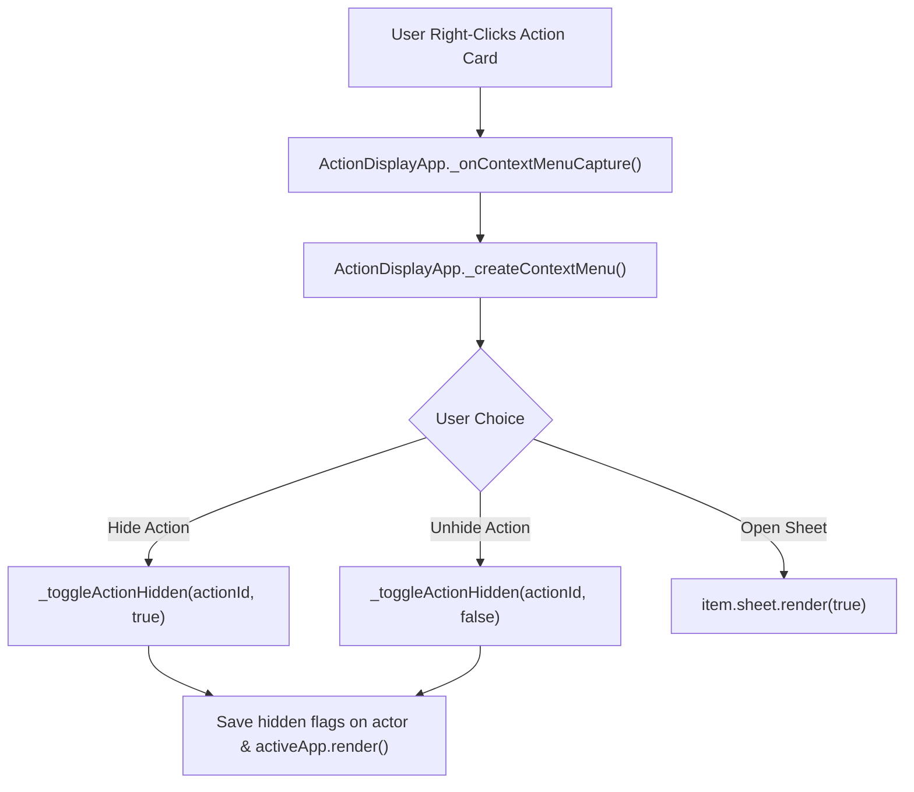

# Function Call Tree & Developer API Reference

This document provides a complete call tree and API reference for **Bakana's Action Display**. It details how hooks, class methods, state managers, and system adapters interact during rendering and user events.

---

## 1. Module Lifecycle & Event Call Tree

```
[Foundry VTT Hooks]
  │
  ├── Hooks.once('init')
  │    ├── registerAdapters()
  │    │    ├── import(systemAdapterPath) ──► actionDisplay.registerSystemAdapter()
  │    │    └── MODULE_ADAPTERS loop      ──► actionDisplay.registerModuleAdapter()
  │    ├── Token.prototype._onClickRight (Wrapped: flags closeDetachedHUD)
  │    └── actionDisplay.init()
  │
  ├── Hooks.once('ready')
  │    └── TokenHUD.prototype.clear & close (Wrapped: calls handleHUDClose())
  │
  ├── Hooks.on('renderTokenHUD')
  │    ├── if activeApp exists for token ──► return (preserve active instance)
  │    ├── if activeApp exists for other token ──► activeApp.close()
  │    └── activeApp = new ActionDisplayApp(token)
  │         └── activeApp.render({ force: true })
  │
  ├── Hooks.on('updateToken')
  │    ├── if detached ──► return
  │    ├── if movement-only change (x, y, rotation, elevation) ──► return
  │    └── activeApp.render()
  │
  ├── Hooks.on('refreshToken') / Hooks.on('canvasPan')
  │    └── if activeApp isAttached & rendered ──► activeApp.setPosition()
  │
  └── Hooks.on('updateActor') / Hooks.on('updateItem')
       └── activeApp.render()
```

---

## 2. Render & Data Processing Tree

When `activeApp.render()` is invoked, standard `ApplicationV2` context preparation flows through the Coordinator, System Adapters, Module Adapters, and UI state managers:

```
ActionDisplayApp.render()
  └── ActionDisplayApp._prepareContext(options)
       │
       ├── 1. Coordinator Data Pipeline
       │    └── ActionDisplay.getActions(actor)
       │         ├── BaseSystemAdapter.shouldExtractItem(item, actor)
       │         ├── ActionDisplay._extractBaseActions(actor)
       │         │    └── Iterates actor.items ──► creates baseActions[]
       │         ├── BaseSystemAdapter.modifyActions(baseActions, actor)
       │         │    └── System-specific logic (e.g. Dnd5eSystemAdapter, Pf2eSystemAdapter)
       │         │         ├── Calculates item uses, spell slots, ammunition
       │         │         ├── Builds subActions[] array for multi-option items
       │         │         └── Filters depleted actions (if setting enabled)
       │         ├── BaseModuleAdapter.modifyActions(systemActions, actor)
       │         │    └── Module-specific filters (e.g. MidiQolModuleAdapter automation-only filter)
       │         └── Core Post-Processing
       │              └── ActionDisplay.isActionHidden(actionId) ──► flags hidden actions
       │
       ├── 2. Tab State & Context Setup
       │    ├── Sync TabSideState instances (this.leftTabs & this.rightTabs)
       │    ├── Build HUDTab hierarchy trees (this.leftGroups & this.parentGroups)
       │    └── BaseSystemAdapter.modifyContext(context)
       │         └── Formats spell level subtabs & precomputes tab sort ordering
       │
       ├── 3. Action Filtering
       │    └── Filter finalActions[] against active TabSideState filters
       │         ├── leftTabs.activeParents & leftTabs.activeSubTypes
       │         └── rightTabs.activeParents & rightTabs.activeSubTypes
       │
       └── 4. Render Template
            └── Renders templates/action-display.html with scrollable container preserved
```

---

## 3. User Interaction & Event Call Tree

### A. Tab Interactions (Left & Right Columns)

```
[User Clicks Tab Header]
  │
  ├── Left-Click Parent Tab Header
  │    └── ActionDisplayApp._onToggleLeftParent / _onToggleRightParent
  │         └── HUDTab.onLeftClick(app, sideState, groups, event)
  │              └── TabSideState.selectParent(parentId, groups)
  │                   ├── Exclusive selection: clears other parent tabs & their sub-tabs
  │                   └── Sole active parent with 0 active sub-tabs ──► resets side to default ('all')
  │
  ├── Right-Click Parent Tab Header
  │    └── ActionDisplayApp._onToggleLeftParentRightClick / _onToggleRightParent
  │         └── HUDTab.onRightClick(app, sideState, groups, event)
  │              └── TabSideState.toggleParent(parentId, groups)
  │                   ├── First Click: Clears all active sub-tabs under this parent (reset shortcut)
  │                   └── Second Click: Toggles parent OFF (falls back to 'all' if no parents left active)
  │
  ├── Left-Click Sub-Tab Header
  │    └── ActionDisplayApp._onChangeLeftSubActionType / _onChangeSubActionType
  │         └── HUDTab.onLeftClick(app, sideState, groups, event)
  │              └── TabSideState.selectSub(parentId, type, groups)
  │                   ├── Multiple sub-tabs active ──► isolates clicked sub-tab
  │                   └── Sole active sub-tab ──► toggles it off
  │
  └── Right-Click Sub-Tab Header
       └── ActionDisplayApp._onToggleLeftSub / _onToggleRightSub
            └── HUDTab.onRightClick(app, sideState, groups, event)
                 └── TabSideState.toggleSub(parentId, type, groups)
                      └── Toggles sub-tab ON/OFF (multi-select)
```

### B. Action Card Interactions

```
[User Interacts with Action Card]
  │
  ├── Left-Click Action Card
  │    └── ActionDisplayApp._onRollAction(event)
  │         ├── Multiple subActions?
  │         │    ├── Target is already a subAction option ──► option.rollAction()
  │         │    └── Target is main card ──► ActionDisplayApp._onToggleSubActionDropdown(event)
  │         └── Single Action ──► action.rollAction()
  │
  └── Right-Click Action Card
       └── ActionDisplayApp._onContextMenuCapture(event)
            └── ActionDisplayApp._createContextMenu()
                 ├── Click "Hide Action"   ──► ActionDisplayApp._toggleActionHidden(actionId, true)
                 ├── Click "Unhide Action" ──► ActionDisplayApp._toggleActionHidden(actionId, false)
                 └── Click "Open Sheet"    ──► item.sheet.render(true)
```

---

## 4. Use Case Call Flowcharts

### Flowchart 1: Token Selection & Initial HUD Render


### Flowchart 2: Tab Click & State Modification


### Flowchart 3: Rolling Actions & Multi-Option Dropdowns


### Flowchart 4: Right-Click Action Card & Context Menu


---

## 5. Class & Module Method Reference

### `src/action-display.js` — Coordinator (`ActionDisplay`)
- **`init()`**: Initializes the coordinator instance.
- **`registerSystemAdapter(adapter)`**: Registers the active system adapter.
- **`registerModuleAdapter(adapter)`**: Registers an active module adapter.
- **`getActions(actor)`**: Executes the main 4-stage action processing pipeline for an actor.
- **`_extractBaseActions(actor)`**: Extracts system-agnostic base actions from an actor's item inventory.
- **`isActionHidden(actionId)`**: Checks if an action ID is marked as hidden.
- **`setHiddenActions(hiddenSet)`**: Updates user-hidden actions for an actor.

### `src/ui/action-display-app.js` — UI Window (`ActionDisplayApp`)
- **`render(force, options)`**: Renders or updates the ApplicationV2 window.
- **`_prepareContext(options)`**: Prepares context data, triggers coordinator pipeline, and builds tab trees.
- **`_onRender(context, options)`**: Attaches DOM event listeners and scroll position listeners.
- **`setPosition(positionMode, options)`**: Calculates 60fps HUD positioning relative to token or detached coordinates.
- **`_onRollAction(event)`**: Triggers action rolls or toggles multi-option dropdowns.
- **`_createContextMenu()`**: Spawns custom right-click context menu for action cards.
- **`_toggleActionHidden(actionId, shouldHide)`**: Flags an action card as hidden/unhidden and re-renders.

### `src/ui/tab-side-state.js` — Tab State Manager (`TabSideState`)
- **`constructor({ side, cached, getDefaultSubTypes })`**: Initializes left or right tab column state.
- **`resetToDefault()`**: Resets column to `'all'` parent and default sub-types.
- **`selectParent(parentId, groups)`**: Handles exclusive left-click parent selection.
- **`toggleParent(parentId, groups)`**: Handles multi-stage right-click parent toggling.
- **`selectSub(parentId, type, groups)`**: Handles left-click sub-tab isolation/toggling.
- **`toggleSub(parentId, type, groups)`**: Handles right-click sub-tab multi-select toggles.
- **`prune(groups)`**: Removes sub-types that are no longer present in active parent tabs.
- **`serialize()`**: Exports tab state for per-actor persistence.

### `src/ui/hud-tab.js` — Unified Tab Node (`HUDTab`)
- **`constructor(options)`**: Instantiates a tab node with depth `level`, `rootParent`, and child `subTabs`.
- **`addSubTab(subTabConfig)`**: Appends a child sub-tab, updating parent and level references.
- **`getOrder()`**: Returns array of child sub-tab IDs in display order.
- **`updateOrder(orderArray)`**: Re-orders child sub-tabs matching an ordered ID array.
- **`getSubTab(subId)`**: Recursively searches for a sub-tab node by ID.
- **`onLeftClick(app, sideState, groups, event)`**: Executes left-click selection logic.
- **`onRightClick(app, sideState, groups, event)`**: Executes right-click toggle logic.

### `src/adapters/system/base-system-adapter.js` — System Adapter Interface (`BaseSystemAdapter`)
- **`isCompatible()`**: Returns whether adapter matches active game system.
- **`shouldExtractItem(item, actor)`**: Performance filter to bypass unneeded item allocations.
- **`modifyActions(actions, actor)`**: Modifies base actions with system-specific calculations.
- **`modifyContext(context)`**: Customizes tab layout context and sub-tab ordering.
- **`getItemTypeLabel(parentId)` / `getItemTypeIcon(parentId)`**: Returns tab labels and font-awesome icons.
- **`getSpellLevelLabel(level)`**: Localizes spell level sub-tab labels.
