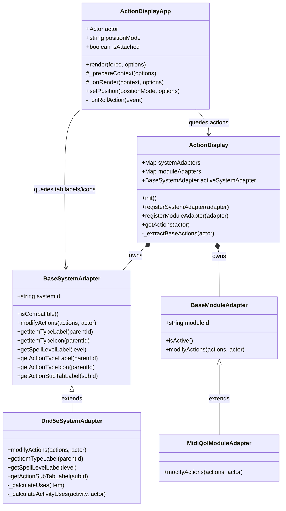
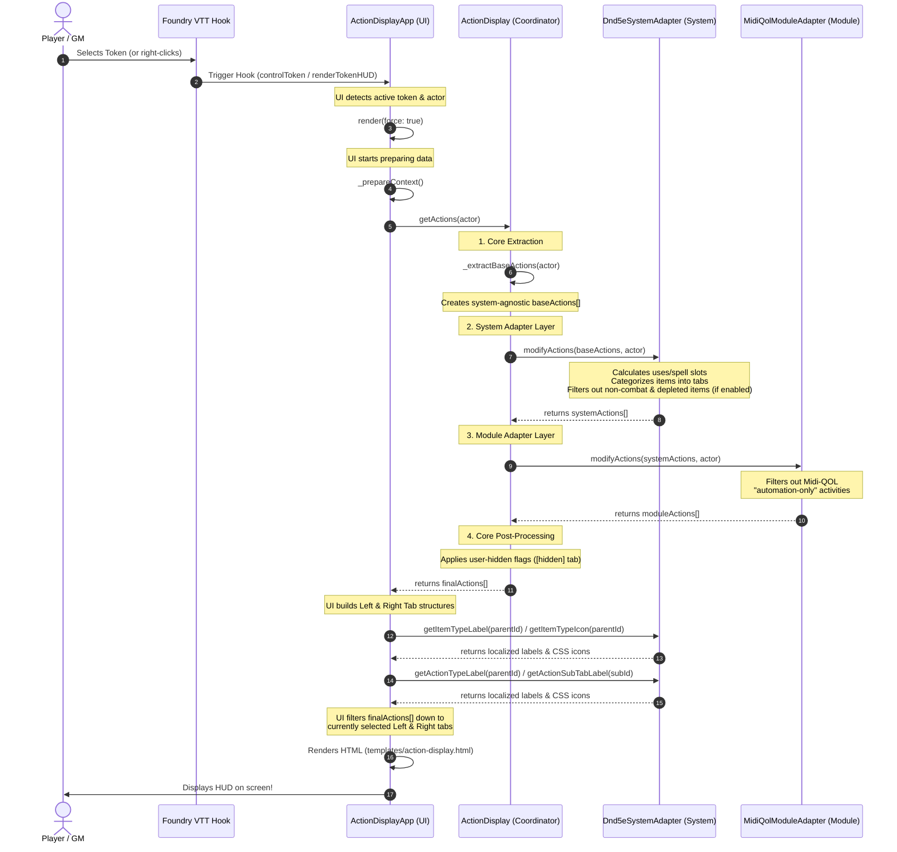

# Architecture & Lifecycle Guide

This document explains the architecture of **Bakana's Action Display** and provides a visual guide to how the different class layers integrate, culminating in the rendering of the Token HUD.

---

## 1. Architectural Layers

The module is built using a clean **pipes-and-filters / adapter** architecture, divided into four distinct layers:

```
┌────────────────────────────────────────────────────────┐
│                        UI Layer                        │
│                (ActionDisplayApp)                      │
└──────────────────────────┬─────────────────────────────┘
                           │ queries actions & layout
                           ▼
┌────────────────────────────────────────────────────────┐
│                    Coordinator Layer                   │
│                    (ActionDisplay)                     │
└──────────────────────────┬─────────────────────────────┘
                           │ runs pipeline
                           ▼
┌────────────────────────────────────────────────────────┐
│                  System Adapter Layer                  │
│        (BaseSystemAdapter ◄─── Dnd5eSystemAdapter)      │
└──────────────────────────┬─────────────────────────────┘
                           │ modifies & categorizes
                           ▼
┌────────────────────────────────────────────────────────┐
│                  Module Adapter Layer                  │
│      (BaseModuleAdapter ◄─── MidiQolModuleAdapter)     │
└───────────────────────────┬────────────────────────────┘
                            │ filters & augments
                            ▼
                    [ Final HUD Render ]
```

### 1. Core / Coordinator (`ActionDisplay`)
*   **Role**: The central pipeline controller (a singleton instance exported from `src/action-display.js`).
*   **Responsibilities**:
    *   Detects the active game system and registers the appropriate system and module adapters.
    *   Performs the **Core Extraction**: iterates over all items on an actor and extracts a basic, system-agnostic list of actions (name, image, item ID, and roll functions).
    *   Runs the pipeline: `Core Extraction ──► System Adapter ──► Module Adapters ──► Core Post-Processing (User-Hidden Filters)`.

### 2. System Adapter Layer (`BaseSystemAdapter`)
*   **Role**: Handles system-specific rules, resource calculations, and terminology.
*   **Responsibilities**:
    *   Maps raw items into system-specific categories (e.g., separating weapons, spells, and features in D&D 5e).
    *   Extracts and calculates resource uses (e.g., spell slots, item charges, or D&D 5e v4+ Activity uses).
    *   Filters out depleted actions if the "Filter Depleted Actions" setting is enabled, using system-specific rules (e.g., checking D&D 5e activities).
    *   Provides system-specific localization labels and icons for the left-side and right-side tabs (falling back to hardcoded English in the base class if no specific adapter exists).

### 3. Module Adapter Layer (`BaseModuleAdapter`)
*   **Role**: Handles third-party module integrations (like `midi-qol`) without cluttering the core or system layers.
*   **Responsibilities**:
    *   Inspects active module flags on actions and modifies them (e.g., hiding Midi-QOL "automation-only" activities from the player-facing HUD).

### 4. UI Layer (`ActionDisplayApp`)
*   **Role**: The rendering engine, built on Foundry VTT's modern `ApplicationV2` (`HandlebarsApplication`) framework.
*   **Responsibilities**:
    *   Listens to Foundry hooks (like token selection) to position and render the HUD.
    *   Coordinates attachment/detachment states and tracks position coordinates.
    *   In `_prepareContext()`, it requests the processed actions from the Coordinator, queries the active system adapter for the tab layouts, filters the actions to match the active tabs, and renders the Handlebars template (`templates/action-display.html`).

---

## 2. Class Relationships

The following diagram shows how the classes are structured and how they reference one another:



---

## 3. The HUD Render Pipeline

This sequence diagram traces the exact lifecycle of how the HUD is created and rendered when a user selects a token in Foundry VTT:


